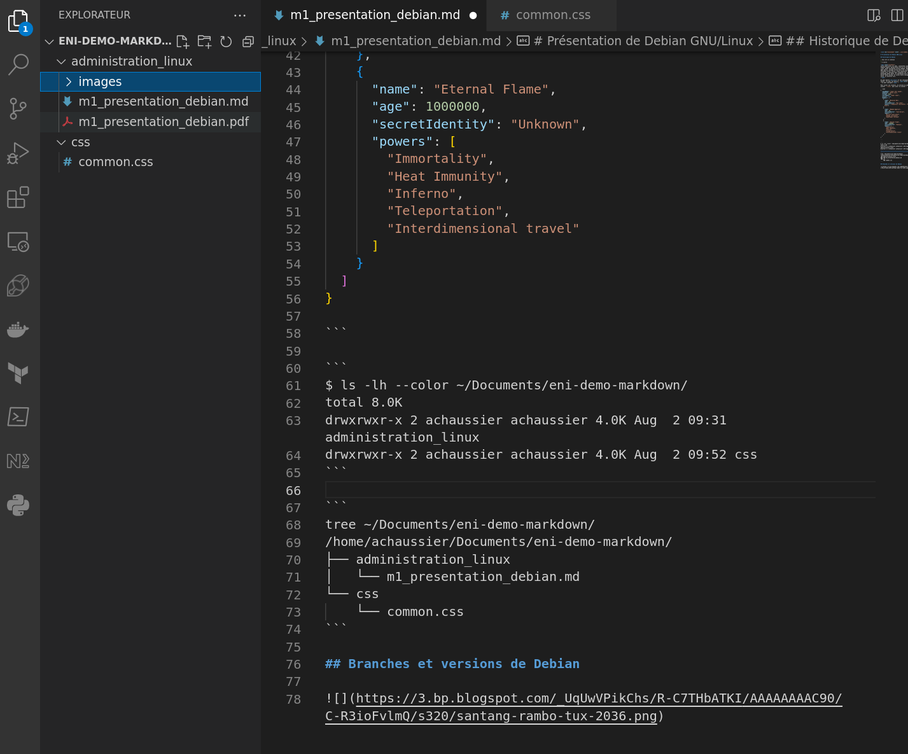

<link rel="stylesheet" href="../css/common.css">

# Présentation de Debian GNU/Linux

## Historique de Debian

> Ceci est un citation
> 
> [Titre2](#branches-et-versions-de-debian)

<span class="blueText">
Lorem ipsum dolor sit amet, consectetur adipiscing elit. Quisque nec feugiat ligula. Nullam porta non mi ut tincidunt. Curabitur sed porta risus. Donec vestibulum rutrum commodo. Phasellus suscipit eget orci eget mattis. Aliquam rutrum felis vel risus volutpat porttitor. Donec tincidunt tortor tellus, vitae consectetur velit blandit sit amet. In turpis arcu, pulvinar quis vulputate non, aliquet eu elit. Aliquam malesuada metus metus, at vestibulum elit tempor eu. Cras tempus magna auctor metus dictum, at luctus nulla consequat. Aliquam non efficitur justo, ac placerat nisl.
</span>

On peut mettre **en gras** et *en italique*. On peut aussi ~~barrer du texte~~. Et pour les motivés, <span style="text-decoration: underline;">on peut souligner</span> !

<span>

Pour lister les fichiers, on utilise la commande `ls` et on peut ajouter `--color` pour avoir la couleur !

```json
{
  "squadName": "Super hero squad",
  "homeTown": "Metro City",
  "formed": 2016,
  "secretBase": "Super tower",
  "active": true,
  "members": [
    {
      "name": "Molecule Man",
      "age": 29,
      "secretIdentity": "Dan Jukes",
      "powers": ["Radiation resistance", "Turning tiny", "Radiation blast"]
    },
    {
      "name": "Madame Uppercut",
      "age": 39,
      "secretIdentity": "Jane Wilson",
      "powers": [
        "Million tonne punch",
        "Damage resistance",
        "Superhuman reflexes"
      ]
    },
    {
      "name": "Eternal Flame",
      "age": 1000000,
      "secretIdentity": "Unknown",
      "powers": [
        "Immortality",
        "Heat Immunity",
        "Inferno",
        "Teleportation",
        "Interdimensional travel"
      ]
    }
  ]
}

```

```
$ ls -lh --color ~/Documents/eni-demo-markdown/
total 8.0K
drwxrwxr-x 2 achaussier achaussier 4.0K Aug  2 09:31 administration_linux
drwxrwxr-x 2 achaussier achaussier 4.0K Aug  2 09:52 css
```

```
tree ~/Documents/eni-demo-markdown/
/home/achaussier/Documents/eni-demo-markdown/
├── administration_linux
│   └── m1_presentation_debian.md
└── css
    └── common.css
```

## Branches et versions de Debian


Il sffit de [Télécharger VSCode](https://code.visualstudio.com/).



1. Faire ça

    

2. Et puis ça

    ```
    Mon joli code !!!
    
    PWET
    ```

3. PWWET \o/


| Application | Description |
| --- | --- |
| [Git](https://git-scm.com/) | Gestionnaire de code source |
| [Bat](https://github.com/sharkdp/bat) | CAT aux stéroïdes |